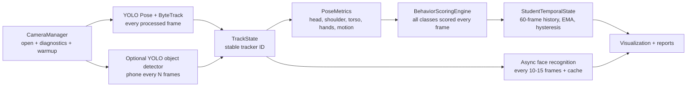

# EduAware Classroom Detection Architecture

## Runtime Pipeline



## Behavior Classes

- `ATTENTIVE`: upright posture, aligned head, front/board orientation or rear-view shoulder alignment, moderate motion.
- `WRITING`: head angled down, hands near desk, stable posture, small repeated wrist motion. This is counted as engaged attention.
- `USING_PHONE`: phone object cue when available, prolonged downward focus, hands close together, hands near lap/desk/head.
- `SLEEPING`: prolonged head-down pose, slouch, very low movement, arms/hands near head. It is intentionally suppressed while writing motion is present.
- `STANDING`: vertical body expansion, upright torso, recent height rise.
- `DISTRACTED`: side-looking, head up/away, excessive body motion, torso turned away, weak task context.

## Attention Formula

The live attention score is a weighted, smoothed value:

```text
attention_score =
  0.25 * head_pose +
  0.20 * posture +
  0.20 * gaze_or_orientation +
  0.15 * movement_quality +
  0.20 * task_context
```

`WRITING` can score high because note-taking is productive. `USING_PHONE`,
`SLEEPING`, and `DISTRACTED` apply penalties after class scoring.

## Temporal Logic

- Each tracked student keeps the last `60` assessments.
- Raw class scores are smoothed with EMA (`EMA_ALPHA = 0.22`).
- Hysteresis requires the new class to beat the current class by
  `HYSTERESIS_MARGIN = 0.12`.
- A label must remain eligible for `MIN_SWITCH_FRAMES = 8` before switching.
- Sleeping and phone states require temporal evidence unless a phone object is
  actually detected.

## Multi-Angle Robustness

The classifier does not depend on face landmarks alone. For side and rear views
it uses shoulder symmetry, shoulder/hip alignment, torso lean, vertical body
profile, hand positions, and motion history. Rear-view students can still be
classified as attentive when shoulders and torso stay aligned toward the board.

## Face Recognition Architecture

Tracking remains continuous and identity is attached to the tracker ID. Face
recognition should run asynchronously every `FACE_RECOGNITION_EVERY_N` frames,
with cached identity, TTL decay, and periodic revalidation. This avoids blocking
pose inference and prevents identity switching during temporary occlusions.

## Recommended Models

- Fast CPU: `yolov8n-pose.pt`, `imgsz=416-480`.
- Balanced GPU: `yolov8s-pose.pt`, `imgsz=640`, FP16.
- Phone detection: enable `--objects` with `yolov8n.pt` for COCO cell-phone
  cues, or replace with a classroom/fine-tuned phone detector for better rear
  angle performance.
- Face recognition: keep the existing face database pipeline behind the
  `FaceRecognizerAdapter` interface in `face_recognition_pipeline.py`.

## Testing Strategy

- Unit-test pose metrics with synthetic keypoints for front, side, rear,
  writing, sleeping, and standing poses.
- Validate on short classroom clips from front, side, and rear cameras.
- Label 30-60 second segments and compare per-track behavior timelines.
- Specifically test writing versus sleeping: note-taking should remain
  `WRITING` when hands show desk motion.
- Test occlusion by hiding face keypoints; rear/side classification should
  degrade gracefully instead of forcing `UNKNOWN`.
- Measure FPS with `--skip 1` and `--skip 2`; enable `--objects` only if phone
  detection FPS remains acceptable.

